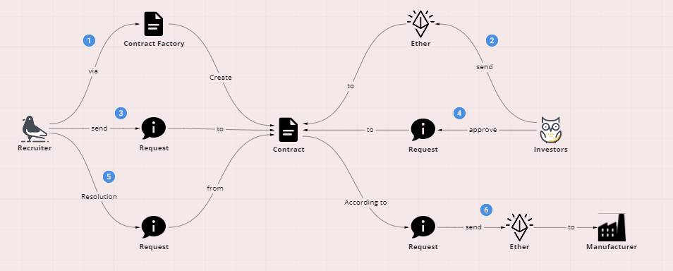

<div id="top"></div>
<div align="center">
  <div align="center" style="width: 50px">


  </div>
  <h3 align="center">Contract Exercise Project</h3>

  <p align="center">
    This is a refactoring of a project from the udemy course.
    <br />
    <br />
  </p>
</div>

<details open="open">
<summary> 🗻 Table of Contents</summary>

- [About This Project](#about-this-project)
  - [Prerequisites](#prerequisites)
- [Useful Links](#useful-links)
- [Usage](#usage)
- [Project structure](#project-structure)

</details>

## About This Project

This is my first project to try to combine blockchain and front-end technology, this project try to resolve simple fundraising loophole problem



### Prerequisites

This project start from **Solidity**, **Next.js** and **React**, and has some base lint rule (eslint and commitlint), so the development may need to pay attention to

## Useful Links

Solidity document (the project use 0.8.9)
https://docs.soliditylang.org/en/v0.8.9/

Rinkeby Scan
https://rinkeby.etherscan.io/

Remix Online Editor
https://remix.ethereum.org

Next.js Config Setting Docs
https://nextjs.org/docs/api-reference/next.config.js/introduction

Cypress Test Command Docs
https://docs.cypress.io/api/commands/and#Chai

## Usage

After you have cloned, there are a few things you must do

1. Make Sure your browser has a wallet extension such as [MetaMask](https://metamask.zendesk.com/hc/en-us)

2. Install the dependencies

```bash
yarn
```

3. Create the `.env` file and add some content to it

```json
MNEMONIC="YOUR_WALLET_PNEUMONIC"
RINKEBY_ADDRESS="YOUR_RINKEBY_ADDRESS"
```

- `RINKEBY_ADDRESS` you can go to **[infura](https://infura.io/)** to create one ( Press the **Create key** in the upper right corner )
- `MNEMONIC` is your account mnemonic phrase ( A long list of English words )

4. then compile and deploy the contract

```bash
yarn run deploy
```

- You will see some little monkey in console

5. Start this project

```bash
yarn run dev
```

## Project structure

My folder structure is separated by feature, as the project is still small, so I want to avoid over-design.

```shell
Project
├─ .asset                                   #  docs asset
├─ .husky                                   #  husky config folder (lint check before commit)
├─ .vscode                                  #  vscode config folder (extension convenience)
├─ ethereum
│  ├─ build                                 #  contract compile result
│  ├─ contracts                             #  contract folder
│  ├─ ADDRESS.json                          #  contract deploy result
│  ├─ compile.js                            #  compile file
│  ├─ deploy.js                             #  deploy file
│  ├─ factory.js                            #  instance file for front-end to use
│  ├─ fundraising.js                        #  instance file for front-end to use
│  └─ web3.ts                               #  instance file for front-end to use
├─ src
│  ├─ feature                               #  core Logic Components
│  ├─ hook                                  #  share Logic for Components
│  ├─ layout                                #  UI that is not part of the main program
│  ├─ lib                                   #  node.js code part
│  ├─ pages                                 #  simplest logic and component arrangement
│  ├─ style                                 #  global css
│  └─ type
└─ ...
```
